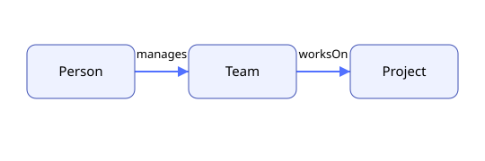

# Ontology StarterKit



[](pyproject.toml) [](LICENSE) [](docs/learn/README.md)

> The practical starter repository for ontology-first AI products.

Ontology StarterKit is an offline-first learning and implementation kit for teams that want to use ontologies, knowledge graphs, and evidence-backed AI products without requiring deep semantic-web expertise.

Start with the [10-minute offline path](docs/learn/README.md), browse a [business ownership pack](examples/business-projects/README.md), a [life-science annotation pack](examples/life-science-annotations/README.md), or the [life-sciences consulting path](docs/consulting/README.md). Neo4j and LLM integrations are optional extensions.

It is intentionally opinionated:

- Start with business value, not ontology purity.
- Use modern AI tooling such as LangChain and Neo4j where it speeds adoption.
- Treat governance, validation, and reproducibility as first-class concerns.
- Clearly distinguish between what is implemented today and what is planned next.

## What Is Implemented Today

### For AI Engineers

- [KG-RAG example](src/integrations/langchain/kg-rag/README.md): a safer LangChain + Neo4j example with environment validation, query guardrails, and tests.
- [Sample ontology assets](src/ontology/README.md): minimal SHACL shapes and RDF data so validation workflows are real.
- [Example packs](examples/hello-ontology/README.md): model, data, shapes, questions, expected outputs and evidence metadata.

### For Product Managers

- [ROI calculator](docs/for-product-managers/roi-calculator/README.md): practical ROI, NPV, and payback templates.
- [Decision framework](docs/for-product-managers/decision-framework.md): how to choose between RDF, property graphs, and hybrid vector-graph systems.
- [Investment one-pager](docs/for-product-managers/investment-one-pager.md): an executive-ready summary template.

### For Founders and Small Teams

- [30-day sprint guide](docs/for-startups/30-day-sprint.md): a realistic startup execution path from problem framing to launch.

### Governance and Release

- [Schema change review policy](docs/governance/schema-change-review.md): review expectations and compatibility guidance for ontology changes.
- [Release process](docs/governance/release-process.md): release checklist, versioning rules, and note quality standards.

### Learn and Apply

- [Learning path](docs/learn/README.md)
- [History of ontology in business, life sciences and AI](docs/history/README.md)
- [Consulting use cases](docs/consulting/README.md)
- [Visual assets](assets/README.md)

## Quick Start

### 1. Clone the repository

```bash
git clone https://github.com/OsamaMoftah/Ontology-StarterKit.git
cd Ontology-StarterKit
```

### 2. Create a local environment

```bash
python3 -m venv .venv
source .venv/bin/activate
pip install -e '.[dev]'
cp .env.example .env
```

### 3. Run tests

```bash
pytest
```

### 4. Run ontology validation locally

```bash
ontokit validate examples/hello-ontology
```

### 5. Run the offline competency query

```bash
ontokit packs
python - <<'PY'
from ontology_starterkit.packs import load_pack
from ontology_starterkit.validation import run_named_query
pack = load_pack('examples/hello-ontology')
print(run_named_query(pack, 'manager'))
PY
```

### 6. Run the optional KG-RAG example

```bash
python3 src/integrations/langchain/kg-rag/graph_rag.py --query "Who manages the team that works on the Alpha Project?"
```

For a local Neo4j only, opt in to the pinned Compose service with
`docker compose --profile services up -d`. Keep the default password local and
replace it before any shared environment.

See the [documentation index](docs/README.md) for the full learning, consulting and engineering paths.

## Repository Structure

```text
Ontology-StarterKit/
├── .github/workflows/            # CI workflows for tests and ontology validation
├── docs/                         # Learn, history, consulting, PM and governance
├── examples/                     # Self-contained domain packs
├── media/                        # Manifest and generated diagrams
├── scripts/                      # Deterministic visual/build helpers
├── src/
│   ├── integrations/langchain/   # LLM and graph integration examples
│   └── ontology/                 # Sample ontology data and SHACL shapes
└── tests/                        # Smoke tests for executable examples
```

## Project Positioning

This repository is suitable as a public, documentation-first starter kit. It is not intended to represent a complete framework or enterprise platform. Every implemented example in the repository should be runnable, reviewed, and supported by accurate documentation.

## Roadmap

Planned next additions include:

- Architecture and scalability patterns
- More integration examples beyond LangChain
- Case studies with measurable outcomes
- Expanded governance templates
- Ontology-guided extraction and identity-resolution lessons
- Optional bounded MCP tools and LinkML authoring adapter

## License

Released under the [MIT License](LICENSE).
