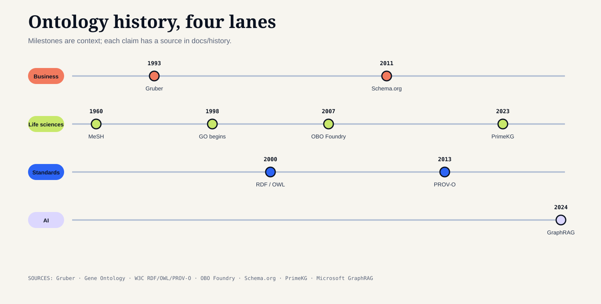

# Ontology history: four lanes, one lesson

Ontology is older than software. The useful thread for a modern team is how
people moved from naming things, to classifying them, to connecting evidence
across institutions.

| Era | Philosophy and language | Business systems | Life sciences | What a starter kit should copy |
| --- | --- | --- | --- | --- |
| 350 BCE | Aristotle's categories make “what kind of thing?” explicit. | — | — | Separate class from instance. |
| 1950s–70s | Controlled vocabularies and thesauri make indexing repeatable. | ERP and data dictionaries standardize enterprise records. | MeSH (1960) gives biomedical indexing a shared vocabulary. | Start with a glossary and ownership. |
| 1990s | Description logics and the Semantic Web formalize machine-readable concepts. | Schema integration becomes a data-warehouse problem. | Gene Ontology begins coordinating biological descriptions (1998; publication 2000). | Give terms stable identifiers and relations. |
| 2000s | RDF, OWL, and SPARQL turn linked statements into a queryable web. | Service-oriented architectures need cross-system mappings. | ChEBI (2004), OBO Foundry (2007), and HPO (2008 onward) make reuse and provenance central. | Keep semantics and quality constraints distinct. |
| 2010s | Knowledge graphs connect entities, rules, and source records at scale. | Master-data, supply-chain, and risk graphs become operating assets. | FAIR practice and evidence codes make annotations reproducible. | Treat provenance, versions, and unknowns as data. |
| 2020s | GraphRAG combines retrieval with structured context. | Consulting teams use semantic layers to trace decisions across portfolios and operations. | PrimeKG (2023) demonstrates multimodal precision-medicine graph research. | Let an answer show its path, limits, and review state. |

The dates are teaching anchors, not a complete intellectual history. See the
[business history](ontology-in-business.md), [life-science history](ontology-in-life-sciences.md), and [AI history](ontology-in-ai.md) for source links.

Source map for the timeline rows: [MeSH history](https://www.nlm.nih.gov/mesh/introduction.html), [Gruber 1993](https://tomgruber.org/writing/ontolingua-kaj-1993/), [Gene Ontology documentation](https://www.geneontology.org/docs/ontology-documentation/), [W3C RDF](https://www.w3.org/TR/rdf11-concepts/), [W3C OWL](https://www.w3.org/TR/owl2-overview/), [OBO Foundry](https://obofoundry.org/), [Schema.org launch](https://search.googleblog.com/2011/06/introducing-schemaorg-search-engines.html), [PROV-O](https://www.w3.org/TR/prov-o/), [PrimeKG](https://www.nature.com/articles/s41597-023-01960-3), and [Microsoft GraphRAG](https://www.microsoft.com/en-us/research/blog/graphrag-unlocking-llm-discovery-on-narrative-private-data/). Each link supports the named milestone or vocabulary; none is evidence that this repository or a consultancy achieved the cited result.

The editable source is `scripts/render_history_timeline.py`. The business,
life-science, standards, and AI lanes are intentionally separate so a shared
date does not imply that the projects had the same purpose or semantics.
