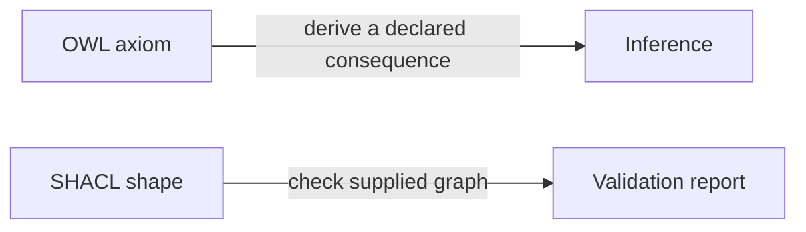

# OWL and SHACL answer different questions

OWL describes formal semantics and can support inference. SHACL describes constraints for checking supplied data. A shape that requires every `Person` to have a name does not infer a name and does not prove that a person exists.



Run the positive and negative fixtures:

```bash
pyshacl -s examples/hello-ontology/shapes.ttl examples/hello-ontology/data/valid.ttl
pyshacl -s examples/hello-ontology/shapes.ttl examples/hello-ontology/data/invalid/missing-name.ttl
```

The first should conform and the second should fail. Neither result establishes that the fictional facts are true in the world.
