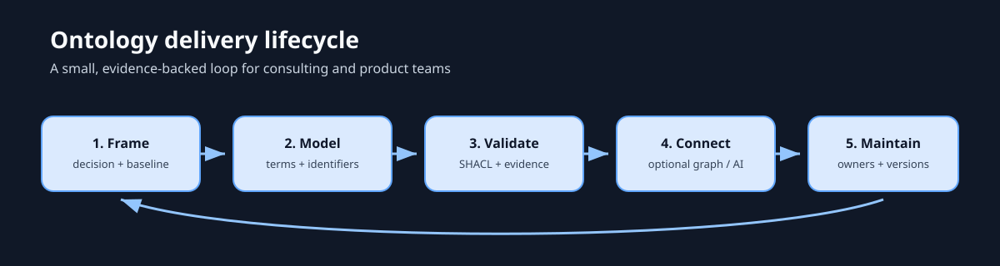

# Media helpers

The media layer keeps visual teaching assets reviewable and reproducible:

- `exports/` contains accessible SVG diagrams and infographics.
- `source/` contains canonical diagram sources and rendering notes.
- `manifest.yaml` records provenance, licenses, alt text and the lesson each
  asset supports.
- [`gallery.md`](gallery.md) is the contact sheet for the eight teaching visuals,
  three consulting visuals, and two authored illustrations.

The lifecycle infographic is a text-equivalent visual: frame a decision, model
terms, validate evidence, connect an optional graph, and maintain the model.
Run `python scripts/render_diagrams.py` to regenerate the pack diagrams and
`python scripts/render_infographics.py` to regenerate the teaching suite.
